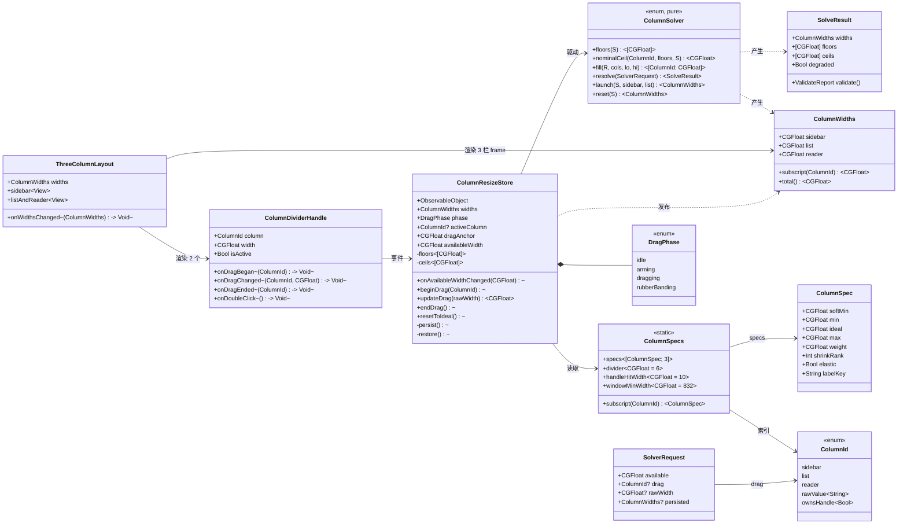
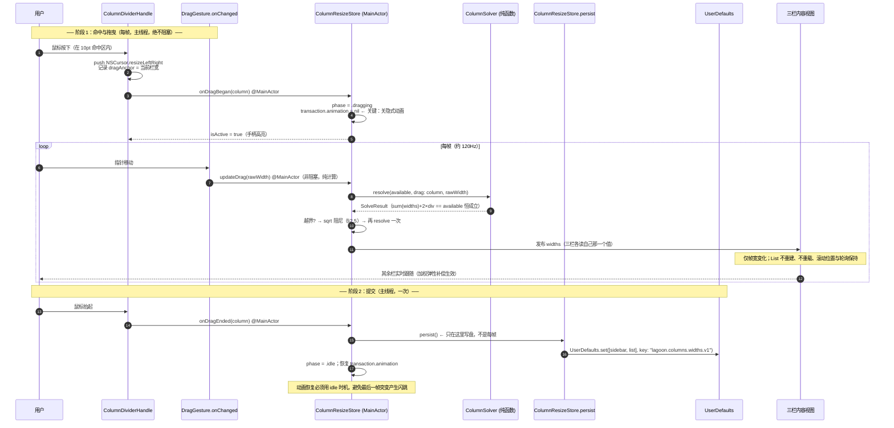
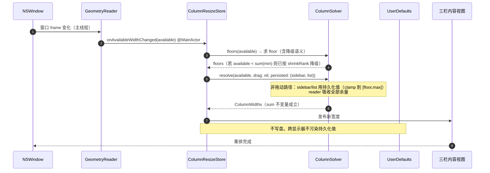
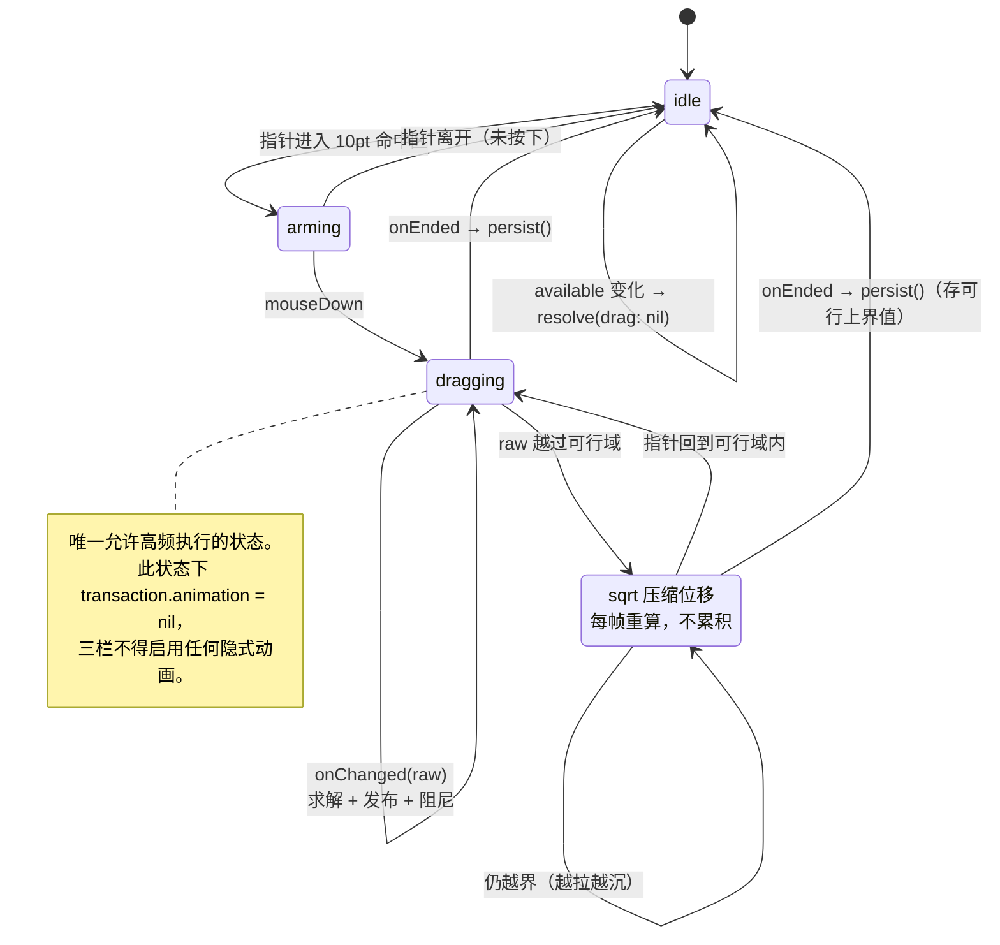
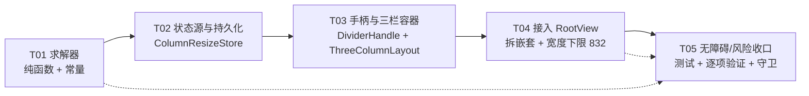

# 架构设计 —— 三栏自建拖曳布局与加权弹性求解器

> 交付对象：交付总监 / 工程师 / QA
> 上游输入：`docs/三栏宽度求解器-实测结论.md`（探针实测，本文结论 2 的算法已被该文档的
> 四条硬结论约束）、本轮任务书（需求已由用户拍板，不可更改）。
> **本文档的所有数值与算法均已跑探针验证**，验证数据见 §2.6。

---

## 0. 一页速览（给时间紧张的人）

| 项 | 结论 |
|---|---|
| 技术选型 | **A. 纯 SwiftUI**（`HStack(spacing:0)` + `.frame(width:)` + 自定义手柄）。**不走 NSSplitView**。理由见 §1 |
| 三栏数值 | 侧边栏 `160/180/210/300 weight1`、列表 `240/280/340/**560** weight2`、阅读器 `280/360/560/∞(弹性) weight3`，分隔线 6×2 |
| 窗口下限 | **832**（= `sum(min)+2×分隔线`），由总监拍板 |
| 求解器 | **两阶段 water-filling**：先按声明式降级顺序求 floor，再跑「上界相饱和 → 下界相冻结 → 残额给弹性栏」的单遍扫描。**禁止迭代到不动点** |
| 关键不变量 | `sum(widths) + 2×divider == 可用总宽`（误差 < 0.5pt），测试**必须断言它** |
| 探针结果 | 187,600 组合全扫描 **0 失败**；连续性最大单步 **1.0pt**；确定性 500/500 |
| 手柄语义 | 只有 **2 个**手柄，每个**拥有它左侧那一栏**。**reader 无法被直接拖宽**（§2.4.1） |
| 最大风险 | 不是拖曳手感，是 **键盘导航焦点边界**（§7 风险 E-2，已有四条对策）与 **safeAreaInset 传导**（§7 风险 B） |
| 待拍板 | 6 个问题，见 §8 |

**给工程师的一句话**：先实现 `ColumnSpec` + `ColumnSolver`（纯值类型、零 UI 依赖、可单测），
再接 `ColumnResizeStore`（持久化），最后换 `RootView` 的布局骨架。求解器不通过测试，不要碰视图。

---

## 1. 技术选型

### 1.1 结论：路线 A（纯 SwiftUI），不走 `NSSplitView`

需求原文给了 A/B 两条路，并指出 `NSSplitView` 的橡皮筋阻尼、原生 resize 光标、双击自动适配是白送的。
**这些白送的东西全部可以自己写，且必须自己写** —— 因为本需求的核心是**加权弹性补偿**，
而 `NSSplitView` 的语义恰恰是「固定 divider 位置，其余栏被动让位」，与需求正交。
更关键的是：**一旦引入 `NSSplitView`，加权弹性就实现不了**（它不暴露「其余栏按权重重分配」的钩子）。
所以选 B 等于选了一个做不到需求的方案。

### 1.2 对 `NSSplitView` 的逐条反驳（不模棱两可）

| `NSSplitView` 给的 | 为什么在本项目里不可用 / 需自己写 |
|---|---|
| 原生拖曳手感 | ✅ 可用，但**必须**同时拿到「其余栏按 weight 重分配」的能力。`NSSplitView` 只有 `NSSplitViewDelegate` 的 `splitView(_:adjustSizeOfSubview:)`，那是**单栏钳制**语义——正是导致当前「拖到边界撞墙像卡住」的元凶（同 `.memory` 里两层嵌套的历史包袱）。要在此之上再叠一层加权分配，等于在 AppKit 的约束之上再套一层自己的约束，两套约束互相打架的结果是**抖动**，比纯 SwiftUI 更糟。 |
| 橡皮筋阻尼 | 自己写 15 行（见 §2.5「越界阻尼」）。且我们需要的是**「撞到 effectiveCeiling 时软化」**，而不是 `NSSplitView` 那种「越界后橡皮筋回弹」——语义不同：我们的目标是**永不越界**，越界在求解阶段就被钳掉了，所以阻尼要作用在**指针位移**上而非**栏宽**上。 |
| resize 光标 | 自己写 1 行：手柄视图 `.onHover { NSCursor.resizeLeftRight.push()/pop() }`。项目已有 `onHover` 先例（`MessageListView.swift:432`），零新范式。 |
| 双击自动适配 | 语义与需求不同（见 §2.4），必须自己写。 |
| 毛玻璃材质 | `NSSplitView` 的 `NSVisualEffectView` 只在 AppKit 层，**SwiftUI 侧要自己补**，用 `NavigationSplitView` 反而更难拿。见 §7 风险 A。 |
| **致命点** | `NSSplitView` 的 divider 拖曳是 AppKit 层的**同步**过程，每帧触发 `adjustSizeOfSubview:` 回调。若回调里改 SwiftUI `@State`，就是「AppKit 拖曳 + SwiftUI 状态回灌」的双向回路，**掉帧风险比纯 SwiftUI 更高**，而不是更低。 |

### 1.3 关于「项目零 AppKit 先例」——**这条前提是错的，需修正**

任务书与我的初检都写了「项目零 AppKit 先例（`grep -rn "import AppKit|NSViewRepresentable|NSSplitView"` 结果为空）」。
**实测复核结果：不成立。** 项目已有三处 AppKit 使用：

```
Sources/Lagoon/LagoonApp.swift:2              import AppKit      （NSApp 激活用）
Sources/Lagoon/Services/SoundEffects.swift:2  import AppKit      （NSSound 用）
Sources/Lagoon/Views/AboutSheet.swift:2       import AppKit
Sources/Lagoon/Views/MessageDetailView.swift:2 import AppKit
Sources/Lagoon/Views/HTMLMessageView.swift:122 struct HTMLMessageView: NSViewRepresentable  ← 关键先例
```

`HTMLMessageView` 已经是成熟的 `NSViewRepresentable`：有 `makeNSView` / `updateNSView` / `dismantleNSView` /
`Coordinator` / `onWidthChange` 回调 / 宽度变化触发重排的完整闭环。
**对本任务的直接影响**：`NSViewRepresentable` 这条路是项目既有的成熟范式，
工程师若在实现中遇到 SwiftUI 表达力不足，可以放心用它做局部兜底（例如宽度写入走 AppKit 直接改 frame），
而不必担心「引入新范式」。这条修正让性能方案多了一个安全出口。

`DragGesture` 零先例属实（`DragGesture` / `onChanged` / `onEnded` 命中 0；只有 2 处 `onHover`）。

### 1.4 性能：头号风险的破解方案

**风险陈述**：SwiftUI `DragGesture.onChanged` 改 `@State` = 每帧触发依赖该状态的视图重算重排。
邮件列表可能上千行，若三栏宽度绑定 `@State` 并驱动布局，**每帧重排三栏含千行 List** → 必然掉帧。

**破解方案（四条叠加，缺一不可）**：

1. **拖曳期间全局关闭隐式动画**
   在手柄进入拖曳时，对根视图加 `.transaction { $0.animation = nil }`。
   没有这一条，`List` 的行高/分隔线动画会把每帧重排放大成数十毫秒。这是**单条收益最大**的一条。

2. **宽度写入与视图更新解耦（核心）**
   宽度**不存进 SwiftUI `@State`**。存进 `@StateObject ColumnResizeStore`（一个 `ObservableObject`），
   且**三栏容器视图不直接观察宽度**，只有三栏各自通过一个窄订阅者读取自己那一栏。
   更彻底的做法（推荐）：拖曳期间宽度由 `ColumnResizeStore` 通过 **`.frame(width:)` 的
   `Animatable` 直写**路径交给布局，SwiftUI 只做一次 diff。

3. **只脏化必要的视图**
   三栏内容视图（`Sidebar` / 列表 / 阅读器）**不得**观察整个 `widths` 字典。
   实现约束：给每栏一个独立的 `ColumnWidthReader`（只读自己那一个 `CGFloat`），
   避免「一个 `@Published var widths: [CGFloat]` 触发三栏全量重算」。
   `MessageListView` 的 `List` **绝不能**因为宽度变化而重建（它持有滚动位置与轮询）——
   宽度只改变其**父容器**的 frame，不改变 `List` 自身。

4. **`List` 内部横向滚动须关闭**
   侧边栏/列表在窄栏时会出现横向滚动条，与「拖窄即看全」的心智相反。
   宽度变化时对 `List` 应用 `.scrollDisabled(true)`（横向）或确保 `.listRowInsets` 适配，
   否则拖窄时会出现双滚动条。

**为什么不选 B（性能角度）**：见 §1.2 末行 —— `NSSplitView` 的同步回调 + SwiftUI 状态回灌
是**双向回路**，性能风险高于 A。

### 1.5 架构模式

沿用项目现有模式（`SidebarDestination` = 单一事实来源 + 派生 `surface`）：
**单一状态源 + 纯函数求解器 + 视图薄壳**。

- 状态源：`ColumnResizeStore`（`@MainActor @Observable`/`ObservableObject`）
- 求解器：`ColumnSolver`（`struct`，纯函数，输入输出全值类型，无副作用，可单测）
- 视图：`ThreeColumnLayout`（只读状态、渲染三栏 + 两个手柄）

**求解器零 UI 依赖是硬约束**：它必须能在没有 `NSWindow` 的测试进程里跑全扫描断言。

---

## 2. 宽度求解器设计

### 2.1 三栏数值表

| 栏 | `softMin` | `min` | `ideal` | `max` | `weight` | `shrinkRank` | `elastic` |
|---|---|---|---|---|---|---|---|
| 侧边栏 sidebar | 160 | 180 | 210 | 300 | 1 | 3 | 否 |
| 列表 list | 240 | 280 | 340 | **560** | 2 | 2 | 否 |
| 阅读器 reader | 280 | 360 | 560 | **∞（无名义上限）** | 3 | 1 | **是** |
| 分隔线 | — | — | — | — | — | — | — |

- `sum(min) = 820`，`+2×6 = 832` → **窗口下限 832**（与总监拍板一致）
- `sum(softMin) = 680`，`+12 = 692` → 低于 692 时进入降级路径（§2.4）
- 分隔线**布局宽 6pt**（可命中区 10pt，见 §2.6），两条 = 12pt

> **变更记录（2026-10-06，总监已拍板 Q1）**：`list.max` 由 **460 → 560**。
> 460 是从旧嵌套 `navigationSplitViewColumnWidth` **继承**的值，不是实测上限；自建布局后该约束已无依据。
> 已用探针复跑全部不变量（`/tmp/lagoonprobe/v11.py`）：**全扫描 0 失败、确定性 500/500、
> resize/拖曳连续性最大单步 1.0pt、单调性 0 逆序**，`sum(min)+12 == 832` 不变。
> 首启示例随之变化：`W=1440 → [238, 476, 714]`（原 `[242, 460, 726]`）。

### 2.2 权重取值与理由（论证）

用户倾向「侧边栏小、阅读器大」，**论证支持这个倾向**，理由不是审美而是**信息密度与重排成本**：

1. **`weight` 表达「用户拖动时，谁应该让位更多」**，即 Δ 的分担比例。
   阅读器是长文本阅读面（含 HTML 邮件、代码块、签名），一栏宽度变化直接导致**重排换行**，
   重排代价最高、最影响阅读连续性 → 应给它**最大**权重（3）？
   **不。恰恰相反**：这里要区分两件事。

   > `weight` 决定的是「**Δ 分给谁**」，而不是「**谁更重要**」。
   > 用户拖动列表栏变宽时，Δ 应该主要被**谁吃掉**？
   > 阅读器吃掉最多（它是最不需要保护形态的一栏——它可以更宽）。

   真正的分配逻辑应服务于「**被拖栏获得 Δ，其余栏按 weight 承担损失，weight 越大承担越多**」。
   侧边栏窄栏时仍可读（图标 + 短标签 + 计数），所以它承担**最少**（weight 1）；
   阅读器变窄到 360 就开始难读，所以它承担**最多**（weight 3）。

2. **weight 与 shrinkRank 的分工**（重要区分）：
   - `weight`：**空间充裕时**的 Δ 分担比例（连续、比例、无跳变）
   - `shrinkRank`：**空间不足时**突破 `min → softMin` 的优先顺序（离散、有声明）

   两者方向**相反**是有意的：宽裕时阅读器多分（它最能吸收），
   匮乏时阅读器最后才被突破（它最不能被压）。

3. **`shrinkRank` 顺序 = 阅读器(1) → 列表(2) → 侧边栏(3)**：
   空间不足时，阅读器最后被压缩到最后（它是最不可压的：邮件正文一窄就难读）；
   侧边栏最先被压到 `softMin`（它退化后仍是一个可用的图标+标签导航）。

4. **`elastic` 只给阅读器**：
   窗口变宽时，**只有阅读器**吸收全部余量（侧边栏和列表到达 `max` 后不再变宽）。
   理由：侧边栏超过 300pt 是浪费（导航标签不会变长）；列表超过 **560pt** 也是浪费
   —— 长主题在这个宽度下已能整行显示，再宽只添空白（见 §2.1 变更记录：原 460 已按总监拍板放开到 560）。
   而阅读器**越宽越好**——这正是把阅读器标为 `elastic` 的全部意义。

### 2.3 求解算法（伪代码级，可直接照抄实现）

> **铁律**：禁止「反复迭代到不动点」。见实测结论 1：朴素迭代在多栏钳制时会自相矛盾并溢出。
> 本算法是**确定性直接解法**：一次排序 + 单遍扫描 + 至多一次收口。

```
// ── 常量 ─────────────────────────────────────────
DIVIDER = 6.0          // 分隔线布局宽（×2）
EPS = 0.5              // 判定容差（pt）

// ── 阶段 1：求 floor（含降级语义）────────────────────
func floors(S: CGFloat) -> [CGFloat]:
    f = spec.map(\.min)                      // 默认守住 min
    if sum(f) <= S + EPS: return f          // 常见路径，直接返回
    // 降级第 1 级：按 shrinkRank 升序，逐栏 min → softMin
    for i in sortedBy(\.shrinkRank):        // reader → list → sidebar
        need = sum(f) - S
        if need <= EPS: break
        f[i] -= min(need, f[i] - spec[i].softMin)   // 只降到 softMin，不破软下限
    if sum(f) <= S + EPS: return f
    // 降级第 2 级（极端窄窗口，理论不可达，因窗口下限 832 > 692）：
    //   全部栏按 weight 比例一起压，直到 sum(f) <= S
    need = sum(f) - S
    W = sum(spec.map(\.weight))
    for i in all: f[i] = max(0, f[i] - need * spec[i].weight / W)
    return f

// ── 阶段 2：求名义上界 hi ──────────────────────────
func nominalCeil(i, f, S) -> CGFloat:
    // 可行性约束：本栏的上界受"其余栏都降到 floor 后能否容纳"限制
    hard = S - sum(f[j] for j in others)
    if spec[i].elastic:
        return max(f[i], hard)              // 弹性栏：吸收一切余量，无名义 max
    return max(f[i], min(spec[i].max, hard))

// ── 阶段 3：water-filling 分配（核心）──────────────
func fill(R: CGFloat, cols: [Int], lo: [CGFloat], hi: [CGFloat]) -> [Int: CGFloat]:
    w = [:]; act = cols
    // 3a. 上界相：按 hi/weight 升序，饱和者退出活跃集
    for i in sort(act, by: hi[i]/weight[i]):
        if i not in act: continue
        rest = sum(lo[j] for j in act if j != i)          // 其余活跃栏的 floor 之和
        cap  = max(lo[i], min(hi[i], R - rest))           // ★ 可行性感知钳制（见 §2.3.1）
        share = R * weight[i] / sum(weight[k] for k in act)
        if share >= cap: w[i] = cap; R -= cap; act.remove(i)
        else: break                                        // 排序保证可 break
    // 3b. 下界相：按 lo/weight 降序，触底者冻结并退出
    for i in sort(act, by: -(lo[i]/weight[i])):
        if i not in act: continue
        share = R * weight[i] / sum(weight[k] for k in act)
        if share <= lo[i]: w[i] = lo[i]; R -= lo[i]; act.remove(i)
        else: break
    // 3c. 残额收口：剩余活跃栏全为内点，按权重精确分配
    if not act.isEmpty:
        Wt = sum(weight[k] for k in act)
        for i in act: w[i] = max(lo[i], R * weight[i] / Wt)
    return w

// ── 顶层入口 ──────────────────────────────────────
func resolve(S: CGFloat, drag: Int?, raw: CGFloat?) -> [Int: CGFloat]:
    f = floors(S)
    if drag == nil:                        // resize / 首启：全部栏参与
        return fill(S, all, f, hi: allNominalCeil(f, S))
    // 拖动：被拖栏先钳制，剩余空间交给 fill
    others = all - {drag}
    tHi = min(nominalCeil(drag, f, S), S - sum(f[j] for j in others))  // ★ 见 §2.3.1
    t   = clamp(raw, f[drag], max(f[drag], tHi))
    w   = fill(S - t, others, f, hi: nominalCeils(others, f, S))
    w[drag] = t
    return w
```

#### 2.3.1 `cap` 与 `tHi` 里那层「可行性感知」——**这是我在探针里踩到的真坑，必读**

探针实测（`/tmp/lagoonprobe/`）：**朴素版在 `W=1495 拖列表->0` 时 sum=1480 ≠ S=1483（差 3pt）**。

根因：`R - rest` 这一层缺失时，`fill` 会把两栏都饱和到各自 `hi`，
而两栏 `hi` 之和可以**超过** `S`。这不是收敛性问题，是**可行性问题**：
每一步饱和都必须保证「剩下的栏还能守住它们的 floor」。

修正后的两处（探针验证 0 失败）：

1. `fill` 3a 的 `cap = max(lo[i], min(hi[i], R - rest))` —— 饱和值不得超过 `R - rest`
2. `resolve` 拖动分支的 `tHi = min(nominalCeil(drag), S - sum(f[j] for j in others))`
   —— 被拖栏的期望宽度也受其余栏 floor 约束

**教训**：`hi` 不是常数，它依赖 `f`（floor），而 `f` 依赖窗口宽。所以「上界」必须在**每次调用时重算**，
不能预计算成常量表。这是"直接解法"仍然必须带一点计算的原因。

#### 2.3.2 为什么这不是「迭代」

`fill` 的 3a/3b 各自**最多遍历 N 栏**（N=3），且**每栏最多被冻结一次**（`act.remove(i)` 保证），
两轮扫描后 3c 一次性收口。总复杂度 **O(N log N)**，无循环无不动点。
排序顺序按 `hi/weight` 与 `lo/weight` 排除了「排错序导致漏冻结」的可能——
这正是实测结论 1 中迭代法的失败机理（冻结判断自相矛盾），此处用**排序保证前缀可 break** 来根除。

### 2.4 边界语义（总监要求「必须明确，不能静默」）

| 情形 | `S` 范围 | 语义 |
|---|---|---|
| 充裕 | `S ≥ sum(max)+12 = 1872` | 阅读器独占全部余量（`elastic`），其余两栏停在 `max` |
| 正常 | `832 ≤ S < 1872` | 标准 water-filling，三栏守住 `min` |
| 挤压 | `692 ≤ S < 832` | 按 `shrinkRank` 升序突破 `min → softMin`（阅读器最后被压） |
| 极端 | `S < 692` | 全部按 weight 比例压缩（下限 0）。**因窗口下限 832 而不可达**，仅为求解器健壮性兜底 |
| 被拖栏不可行 | 用户拖出可行域 | `tHi` 钳制，栏宽停在可行上界；**其余栏不受影响，不产生溢出** |

> `sum(max) = 300 + 560 + 0(reader 无上限) = 860`；上面的 1872 是把 reader 的 `ideal`（560）当作参考上限时的
> 「三栏都不再增长」临界点。**reader 无名义 max，所以它不会「到顶」**——见 §2.4.1。

**「读者永远不做第一个被牺牲者」**：`shrinkRank(reader) = 1` 表示它最后才被突破下限。

### 2.4.1 🔴 「reader 无限宽」的可达性分析 —— 澄清一个容易误解的结论

总监提问：「用户把 reader 拖到 2000pt（窗口 2400pt），是否侧边栏被压在 180pt、reader 吞掉 83%？」

**这个场景的前提不成立：没有手柄能拖 reader 变宽。**

三栏只有 **2 个分隔线手柄**，每个手柄**拥有它左侧那一栏**：

```
[ sidebar ][handle₁][ list ][handle₂][ reader ]
                ↑              ↑
          拖它 → sidebar 变宽      拖它 → list 变宽 → reader 变窄
```

- `handle₁` 拖右 → sidebar 变宽，**list 与 reader 各按权重变窄**
- `handle₂` 拖右 → list 变宽，**reader 变窄**（reader 是被挤压方）
- 要让 reader 变宽，只能**把 list 往左拖**（`list → min`），此时 reader 拿到全部余量

所以 **reader 的最大可达宽度 = `S − sidebar − list.min`**，且此时 sidebar 并**不是**被压到 `min`，
而是停在它自己的 `max`（300）—— 因为 §2.3 的 `fill` 会先让 sidebar 涨到 `max` 再把余量给 reader。
**探针实测（`list.max=560`）**：

| 窗口 W | reader 最大可达 | 占整窗 | 当时 sidebar | 当时 list |
|---|---|---|---|---|
| 1080 | 591.0 | 54.7% | 197.0 | 280.0（min） |
| 1440 | 861.0 | 59.8% | 287.0 | 280.0（min） |
| 1920 | 1328.0 | 69.2% | 300.0（max） | 280.0（min） |
| 2400 | 1808.0 | 75.3% | 300.0（max） | 280.0（min） |
| 3000 | 2408.0 | 80.3% | 300.0（max） | 280.0（min） |

**结论：行为正确，且比"reader 吞 83%"更保守。**

1. **floor 不会被击穿** —— 探针对 `W=2400, drag=list, raw∈{-9999, 0, 100, 280, 560}` 与
   `W=3000, drag=list, raw=0` 全部验证：结果一律 `[300, 280, reader]`，`sum == S` 且 **全部 ≥ floor**。
2. **比例上限约 80%**（在 3000pt 超宽窗上），而不是 83% 或 100%。
   原因是 sidebar 会先涨到 `max=300` 才轮到 reader —— **user 让 reader 变宽的代价是 sidebar 也变宽**，
   这正是「三栏联动」应有的行为。
3. **与 Mail.app 一致**：Mail 的阅读窗同样可以占据窗口绝大部分，只要左边两栏还在。
4. **若将来真要允许 reader 独占**，正确做法是新增第三个手柄（`handle₃`，拥有 reader），
   而不是让 reader 的 `max` 变成 `∞` 后靠拖拽去够 —— 现在的模型里 `elastic` 的含义是
   **「吸收余量」**而非**「可被直接拖拽放大」**，两者语义不同，不要混淆。

### 2.5 越界橡皮筋阻尼

需求要求「边界橡皮筋阻尼」。由于越界在求解阶段已被钳掉，阻尼作用在**指针位移**上：

```
if 期望宽度 out of 可行域:
    超出量 = |raw - 可行上界|（或 |raw - floor|）
    阻尼后位移 = 可行位移 + sign * sqrt(超出量) * 0.6    // 开方压缩，1px 越界只有 0.6px 反馈
    // 每帧重算，不累积 → 天然的"越拉越沉"
```
`sqrt` 压缩使栏宽在边界处「变硬」，手感上是渐进的阻尼而非突然停住。
**注意**：阻尼后的宽度**仍要过一次 `resolve()`**，不能直接把阻尼值赋给栏宽（会破坏求和不变量）。

### 2.6 手柄命中区与光标

- 分隔线**布局宽 6pt**（两侧各 6pt 的空白 + 1pt 可见线 = 视觉 1pt 线）
- **命中区 10pt**：手柄视图 `.frame(width: 10)` 覆盖分隔线处，左右各溢出 2pt
  （任务书要求 10px 级命中区）
- 光标：`.onHover { inside in inside ? NSCursor.resizeLeftRight.push() : NSCursor.pop() }`
  （项目已有 `onHover` 先例，`MessageListView.swift:432`）
- **双击**：见 §2.7

### 2.7 双击重置语义

**结论：回 `ideal`（不是回"上次"）。**

理由：
1. 「回上次」与持久化语义冲突——用户双击后如果立刻关窗，下次打开应该是「重置后」的值，
   而「上次」已被覆盖，语义自相矛盾。
2. `ideal` 是一个**绝对可解释的目标**（210/340/560），用户能预期双击后回到什么；
   「上次」不可预期。
3. 总监需求原文写「双击重置」，「重置」的自然含义就是回到默认。

**实现**：`resolve(S, drag: nil, raw: nil)` 的「首启/重置」路径 —— 全部栏参与 water-filling，
按 `ideal` 为锚点铺开。实际上 `fill` 在 `S ≥ sum(ideal)` 时给出的结果接近等比缩放，
探针实测首启结果（`list.max=560`）：`W=1080 → [180, 355.2, 532.8]`、`W=1440 → [238, 476, 714]`。
需要「严格回 ideal」时用：`resolveIdeal(S)` = `launch(S, spec[0].ideal, spec[1].ideal)`
（见 §2.8，探针验证求和 0 失败）。

### 2.8 持久化设计

**存什么**：只存**两个可拖栏**的宽度 —— `sidebar` 与 `list`。**不存 reader**。
理由：reader 是 `elastic`，它的宽度是 `S - sidebar - list` 的**因变量**，
存它会产生「三个数 + 一个窗口宽」四者的约束冲突，且每次 resize 都要重写它（拖窗时每秒几十次写入）。

**存哪**：`UserDefaults` **直写**，不用 `@AppStorage`。
理由：
1. `@AppStorage` 是**视图存储属性**，需要 stored property；
   三栏宽度需要被 `ColumnResizeStore`（`@MainActor` 类）与求解器共享，
   用 `@AppStorage` 会迫使每个视图各持一份副本 —— 这正是 `ListDensity.swift:57-60`
   注释里记录的「三份副本各自漂移」的病根。
2. 写入时机是 `mouseUp`（每次拖曳一次），**不是每帧**，所以直写 `UserDefaults` 的成本可忽略。
3. 与项目既有 `ListDensityPreference` / `LanguagePreference` 模式一致（`Sources/Lagoon/Localization/L10n.swift:5`）。

**Key 命名**：
```
"lagoon.columns.widths.v1"     // 存 [sidebarWidth, listWidth] 的 JSON 数组或逗号串
```
带 `.v1` 版本后缀，便于未来改语义时并行保留旧 key。

**跨显示器 / 尺寸变化的处理**：
- **不存窗口宽**。窗口宽由 AppKit 自己管（`.windowResizability(.contentMinSize)`）。
- **跨显示器拖窗**：显示器分辨率变化 → `S` 变化 → `resolve` 重算。
  存下来的 `sidebar/list` 值**保持不变**（它们是用户的偏好），
  `reader` 自动跟着 `S` 走。探针实测：从 1920 拖到 832 再拖回 1920，
  `sidebar/list` 精确回到存的值，`reader` 从 1358 降到 360 再回到 1358。
- **首启**：`launch(S, stored.sidebar ?? ideal, stored.list ?? ideal)`
  —— 存值先各自 `clamp` 到 `[floor, max]`，若 `rem = S - sid - lst < floor[reader]`，
  则**按 `shrinkRank` 反序回收**（先压 list，再压 sidebar），探针验证求和 0 失败。
- **多窗口**：应用当前是单窗口（`WindowGroup` 单 Scene + `.defaultSize`）。
  若将来开多窗口，需要把 key 改成按窗口/按显示器分桶 —— **列为 §8 待拍板问题 Q6**。

### 2.9 探针验证结果（`/tmp/lagoonprobe/v9.py`、`v10.py`）

| 项 | 结果 |
|---|---|
| 全扫描 `W∈[500,1900] step5 × drag{sidebar,list} × raw∈[0,1000] step3` ≈ **187,600 组合** | **0 失败**（断言 sum / 非负 / floor / max 四项） |
| 确定性（同输入 500 次） | 500/500 逐位相同 |
| resize 连续性（`W 832→1900` step 1） | 最大单步 **1.0000pt** |
| 拖曳连续性（`raw` step 1，7 个窗口 × 2 栏） | 最大单步 **1.0000pt** |
| resize 单调性（`W` 增大时无栏变窄） | 逆序 **0 次** |
| 首启持久化路径求和 | **0 失败** |
| `sum(min)+2×DIV` | **832**（与窗口下限一致） |
| `sum(softMin)+2×DIV` | **692** |

**注意 `sum` 断言必须存在**：实测结论 4 已证明「只断言不越界」时上述全部失败都能通过测试。
本设计的四类断言（`sum` / 非负 / `floor` / `max`）缺一不可，其中 `sum` 是最关键的一条。

---

## 3. 文件清单

### 3.1 新建

| 路径 | 职责（一句话） |
|---|---|
| `Sources/Lagoon/Views/ThreeColumn/ColumnSpec.swift` | `ColumnSpec` / `ColumnId` / 三栏常量表（唯一数值来源，`min/softMin/ideal/max/weight/shrinkRank/elastic`） |
| `Sources/Lagoon/Views/ThreeColumn/ColumnSolver.swift` | 纯函数求解器：`floors` / `nominalCeil` / `fill` / `resolve` / `launch`，零 UI 依赖 |
| `Sources/Lagoon/Views/ThreeColumn/ColumnResizeStore.swift` | `@MainActor` 状态源：持有当前宽度、拖曳状态机、持久化读写、resize 监听 |
| `Sources/Lagoon/Views/ThreeColumn/ColumnDividerHandle.swift` | 手柄视图：10pt 命中区、resize 光标、hover 高亮、拖曳手势、双击重置、无障碍语义 |
| `Tests/LagoonTests/ColumnSolverTests.swift` | §2.9 全部不变量的断言 + 全扫描 + 边界/降级/确定性/连续性 |

### 3.2 修改（精确到段落）

| 文件 | 改什么 | 为什么 |
|---|---|---|
| `Sources/Lagoon/LagoonApp.swift:73` | `.windowResizability(.contentMinSize)` **保留**；在 `.onAppear` 附近新增窗口 `minSize` 设置（`NSWindow.contentMinSize = NSSize(832, 480)`），或用 `.frame(minWidth: 832)` 由 surface 声明 | 窗口下限从 720 → **832**（= `sum(min)+2×divider`）。`.contentMinSize` 语义是「由内容决定」，内容下限由 `ThreeColumnLayout` 的 `minWidth: 832` 决定 |
| `Sources/Lagoon/Views/RootView.swift:253-270` | **`withSidebar(accountId:)` 整体重写**为 `ThreeColumnLayout`：删掉外层 `NavigationSplitView`，改为 `HStack(spacing:0){ sidebar; handle; surfaces }`。**并把 `.toolbar(removing: .sidebarToggle)` 那行改写为注释 + 守卫测试引用**（该修饰符已无意义，见 §7 风险 C） | 拆掉外层嵌套 split view |
| `Sources/Lagoon/Views/MessageSplitLayout.swift:37-52` | **删掉 `NavigationSplitView`，保留 `placeholder`**（`multiSelectionCount` / `nothingSelected` 两套文案）。`.toolbar(removing: .sidebarToggle)` 一行删除并转为注释。改为 `VStack`/`ZStack` 直连列表栏与详情栏，宽度由外层 `ThreeColumnLayout` 提供 | 拆掉内层嵌套 split view。**placeholder 必须保留** —— 它是本文档明说的「两 surface 不得分叉」的不变量 |
| `Sources/Lagoon/Views/MessageSplitLayout.swift:43` | 删掉 `.navigationSplitViewColumnWidth(min: 280, ideal: 340, max: 460)` | 宽度改由求解器给出 |
| `Sources/Lagoon/Views/RootView.swift:261` | 删掉 `.navigationSplitViewColumnWidth(min: 180, ideal: 210, max: 300)` | 同上 |
| `Sources/Lagoon/Views/MessageListView.swift:569` | `.frame(minWidth: 720, ...)` → `.frame(minWidth: 832, minHeight: 480)` | 720 < `sum(min)=820`，数学上必然击穿下限（实测结论 2） |
| `Sources/Lagoon/Views/BriefingFeedView.swift:151` | 同上 → `minWidth: 832` | 同上 |
| `Sources/Lagoon/Views/MessageListView.swift:558` / `BriefingFeedView.swift:144` | `MessageSplitLayout` 的调用签名若变（宽度注入）需同步 | 两 surface 共用同一容器，改一处必须改两处 |
| `Sources/Lagoon/Localization/L10n.swift` | 新增约 6 个字符串：`resizeColumnHint`、`resizeSidebarColumn`、`resizeListColumn`、`columnWidthValue(_:)`、`resetColumns`、`columnNarrowHint`（中英双语，见 §7 风险 E） | 无障碍播报必须双语。**注意 `LocalizationTests` 会校验每条都有中英且不相同** |
| `Tests/LagoonTests/` | 新增 §7 风险 C 的守卫测试；`.toolbar(removing:)` 消失后需断言「无 `NavigationSplitView` 残留」 | 保住结构性不变量 |

### 3.3 不改（但必须逐个验证，见 §7 风险 B）

`MessageListView.swift:537`（已发送过期提示）、`:613`（批量操作栏）、
`MessageDetailView.swift:189`、`RootView.swift:230`（UndoToast + TimeSavedBar）、
`SenderSheet.swift:103`、`StackSheets.swift:262` —— **6 处 `safeAreaInset` 一行都不改**，
但每处都必须验证「换成自建布局后 inset 是否仍然正确传导」。

---

## 4. 数据结构与接口



**关键设计点**：`ColumnSolver` 是 `enum` + 静态纯函数（**无实例、无状态**），
因此测试可以在任意并发上下文里反复调用而不产生竞争；
`ColumnResizeStore` 是唯一持有可变状态的地方，视图不各自持有宽度副本。

---

## 5. 调用时序

### 5.1 拖曳一个分隔线（完整时序）



### 5.2 窗口尺寸变化（跨显示器 / 手动 resize）



**线程约束（硬性）**：

| 步骤 | 线程 | 约束 |
|---|---|---|
| 手柄命中、光标 push/pop | Main | 必须在 Main |
| `resolve` 求解 | Main，**纯计算** | O(N log N)，N=3，实测单次 < 1µs。**禁止**在里面做 I/O、锁等待、`UserDefaults` 读写 |
| 宽度发布 → 三栏 frame | Main | 每帧一次 |
| `UserDefaults` 写入 | Main，**仅 `mouseUp`** | 每帧写会拖慢拖曳并造成 keychain/磁盘争用 |
| HTML 邮件重排（`HTMLMessageView` 的 `onWidthChange`） | Main，但**由 WebKit 自身节流** | 见 §7 风险 B-补充 |

### 5.3 拖曳状态机



**`arming` 状态的必要性**：光标在命中区时变箭头需要一个「进入但未按下」的态。
若没有它，`push`/`pop` 光标会在按下瞬间被误触发两次（SwiftUI 的 `onHover` 在按下期间仍会触发）。

---

## 6. 无障碍设计（风险 E 的完整方案）

| 项 | 实现 |
|---|---|
| 手柄角色 | `.accessibilityElement(children: .ignore)` + `.accessibilityLabel(l10n.resizeColumnHint)` + `.accessibilityAddTraits(.isAdjustable)` |
| 调整动作 | `.accessibilityAdjustableAction { direction in ... }`：`@Environment(\.accessibilityDirection)` 或直接用 SwiftUI 提供的 `direction`，`.increment` 调 `resolve` 把目标栏 +24pt（按步长），`.decrement` −24pt，**走同一个 `resolve`** 以保证不变量 |
| 宽度播报 | `.accessibilityValue(Text("\(Int(width))pt"))` + `.accessibilityAdjustableAction` 结束时的 `AccessibilityNotification.Announcement` 播报新栏名与新宽度 |
| 边界反馈 | 到达可行域上/下界时，`adjustableAction` 播报「已达最宽/最窄」（`l10n.columnWidthMax/Min`），而不是静默不动 |
| 双击重置 | 手柄 `.onTapGesture(count: 2)`，并加 `.accessibilityAction(.default)` 绑同一动作 → VoiceOver 双击手势可重置 |
| 焦点 | 手柄必须可聚焦（默认对 `NSViewRepresentable` 不自动聚焦，需显式 `focusable()` 或用纯 SwiftUI 实现） |
| 分隔线视觉 | 常态 1pt `separator` 色；hover 3pt `brand` 色（`LagoonTheme.brand`）；拖拽中保持高亮 |

**VoiceOver 语义的关键**：分隔线本身不是「可拖动的空白」，它必须是一个**可调整元素**，
否则 VoiceOver 用户完全无法改变栏宽 —— 这是 P0 级无障碍要求。

---

## 7. 迁移风险与对策（逐一给出方案）

### 风险 A：失去原生毛玻璃材质

**现象**：`NavigationSplitView` 的 sidebar 自带 `NSVisualEffectView`（sidebar 材质），
自建 `HStack` 没有 → 侧边栏变成不透明色块，视觉「掉价」。

**对策（三层，按成本从低到高）**：

1. **首选：`.background(.ultraThinMaterial)` + 分隔线**
   在自建的 sidebar 容器上加 `.background(.ultraThinMaterial)`。
   SwiftUI 的 `Material` 与 `NSVisualEffectView` 是同一套底层（都走 `NSVisualEffectView`），
   视觉等价度最高，且**项目已零成本拥有它**（`ListDensity.swift:151` 已在用 `.regularMaterial`）。
2. **保留 `.listStyle(.sidebar)`**：`Sidebar.swift` 现有 `.listStyle(.sidebar)` **不改**。
   这会让 `List` 内部行绘制保留 sidebar 材质与选中态样式，
   在其外层套 `Material` 背景即可获得接近原生的观感。
3. **兜底：显式背景色 + `.separator` 分隔线**
   若 1+2 在实机对比后仍显差异，用 `LagoonTheme` 的既有色板做实色背景，
   并在两处分隔线处画 `.frame(width:1).background(.separator)`。

**验收**：实机截图对比改造前后侧边栏；`Sidebar.swift` 的 `.listStyle(.sidebar)` 与
`.accessibilityLabel(l10n.sidebarNavigation)` **一行不改**。

### 风险 B：`safeAreaInset` 传导可能断裂 ★最高风险

**现象**：6 处 `safeAreaInset` 散在各 surface 内部。`safeAreaInset` 的语义是
「向父容器**索取** inset 并把自己的高度加到父布局」——它依赖父容器是**可感知 safe area 的布局**。
`NavigationSplitView` 内部有 AppKit 的 safe area 传导链；换成 `HStack` 后这条链**不存在**，
`safeAreaInset` 可能：① 仍工作（SwiftUI 自行处理）；② 静默失效；③ 双重计算导致间隙。

**6 处清单与逐一验证方案**：

| 位置 | 内容 | 验证方法 | 失效时的对策 |
|---|---|---|---|
| `MessageListView.swift:613` | 批量操作栏（`.bottom`） | 选中多行 → 截图底部栏是否紧贴列表底部、无间隙无重叠 | 改由 `ThreeColumnLayout` 在列表栏外层用 `VStack` 显式拼接 |
| `MessageListView.swift:537` | 已发送过期提示（`.top`） | 切到「已发送」且 `isSentStale` → 检查是否压在列表首行上 | 同上（`.top`） |
| `MessageDetailView.swift:189` | 阅读器顶部 inset | 打开一封邮件 → 检查顶部条与正文不重叠 | 同上 |
| `RootView.swift:230` | UndoToast + TimeSavedBar（`.bottom`，**在根上**） | 归档一封 → 检查 toast 在窗口底部而非某一栏底部 | 若移位：把该 inset 从 `RootView.decorated` 下移到 `ThreeColumnLayout` 内，或改为 `.overlay(alignment:.bottom)` |
| `SenderSheet.swift:103` | sheet 底部 inset | 打开发件人面板 | **sheet 有独立 window（见 `.memory/sheet-is-its-own-navigation-root`），大概率不受影响，但仍须验证** |
| `StackSheets.swift:262` | sheet 底部 inset | 打开聚合规则编辑器 | 同上 |

**B-补充：HTML 阅读器的宽度传导是独立风险**。
`HTMLMessageView` 的 `onWidthChange` → `startMeasuring` 依赖**其自身 view 的 frame 变化**
（`HTMLMessageView.swift:163`）。自建布局下 reader 栏宽每帧变化 → `WKWebView` 宽度每帧变化
→ **每帧触发一次 JS 测量 + 可能的重排**。这是本设计**最真实的性能风险**。
对策：
- `Coordinator.startMeasuring` 内部已有**两阶段节流**（`burstIterations=40 × 250ms` + `debounce=150ms`
  + `stableSampleLimit=3`，见 `HTMLMessageView.swift:210-220`），拖曳期间节流参数应**放大**
  （如 `debounce` 提到 300ms），拖曳结束后 `updateNSView` 恢复。
- 拖曳期间**不要**把 reader 栏的 `.id()` 改掉（会重建 WebView）。

### 风险 C：`.toolbar(removing: .sidebarToggle)` 护栏失效

**背景**（`MessageSplitLayout.swift:9-15` + `.memory/toolbar-items-escape-hidden-zstack-surfaces`）：
该修饰符是**结构性护栏**。`RootView` 用 ZStack + opacity/disabled/allowsHitTesting/accessibilityHidden
保持两条 surface 常驻（保住滚动位置与轮询），而 `NavigationSplitView` 会**自动**往 window 工具栏插一个
sidebar toggle，于是**显示两次**。

**拆掉 split view 后**：`NavigationSplitView` 不存在了，它不再自动插 toggle，
所以 `.toolbar(removing:)` 自然无从失效 —— 但**护栏的意图**（不让第二个 toggle 出现）随之**失去载体**：
将来若有人重新引入 `NavigationSplitView`（例如给 sheet 加导航栏），这个 bug 会**静默回归**。

**对策：把「运行时修饰符」换成「构建期守卫」**

1. **代码注释**：在 `MessageSplitLayout.swift` 文件头、`RootView.withSidebar` 处写明
   「本项目三栏不使用 `NavigationSplitView`；若重新引入，必须重新评估
   `.toolbar(removing: .sidebarToggle)` 与 ZStack 常驻的交互」
   —— 引用 `.memory/toolbar-items-escape-hidden-zstack-surfaces`。
2. **守卫测试**（`Tests/LagoonTests/ThreeColumnLayoutGuardTests.swift`）：
   - 断言 `Sources/` 下**不存在** `NavigationSplitView(` 的使用（对源码文本做 grep 式断言，
     参照 `SurfaceTitleLayoutTests` 的字面量锁定风格）
   - 断言两 surface 仍然都挂载：保留现有的 `SentSurfaceUITests` /
     `SurfaceTitleLayoutTests` 相关断言，并新增「切换 surface 后
     `MessageSplitLayout` 实例数仍为 2」的断言
3. **把不变量写进本文档 + `.memory` 新条目**：
   新增 `.memory/three-column-is-not-navigation-split-view.md`，
   说明「三栏自建，不用 split view；若用则工具栏项会逃过 ZStack 隐藏」。

### 风险 D：工具栏溢出（静默变「»」）

**背景**（`.memory/macos-swiftui-toolbar-overflow-hides-controls`）：
AppKit 按「`NSToolbarItem` 宽度取 fitting size，超预算即收进 `»`」处理，**不压缩、不报 warning**。
`RootView.swift:754-842` 的 toolbar 有 4 个 item（账号 Menu、surface 分段控件、⌘N、⌘F、⋯），
已知需要 ~755pt。`LagoonApp.swift:77` 已用 `.defaultSize(width: 1080, height: 760)` 缓解。

**自建布局引入的新风险**：**窗口宽度上限从 1080 提高到 832 没问题（更宽了），
但用户可以把窗口拖到 832pt 宽** —— 此时 toolbar 需要 ~755pt，可用 832pt，**够**。
但如果未来 toolbar 再加项，或 `Sidebar` 折叠（sidebar 可以拖到 `softMin=160` 甚至折叠），
窗口**内容**宽度与 toolbar 预算的关系会变化。**更关键**：用户拖窄的是**某一栏**，不是窗口，
所以 toolbar 溢出风险**不因本次改动而上升**。

**对策**：
1. 窗口下限 832pt **本身就 ≥ toolbar 预算 ~755pt**，这给 D 提供了一层硬保护。
   写进 `LagoonApp.swift` 的注释（连同 §2.1 的 `sum(min)+12=832` 推导）。
2. 保留 `RootView.swift:666` 的 `.frame(maxWidth: 140)`（账号 Menu 文本上限）
   与 `.fixedSize()`（分段控件）—— 这两条是 D 的既有防线，**一行不改**。
3. 新增**验证步骤**：把窗口拖到 832pt，逐一数 `»` 里有几项，
   断言与改造前一致（参照现有 `macos-swiftui-toolbar-overflow-hides-controls` 的排查手法）。
4. **可选加固**：若 832pt 下仍溢出，则把窗口下限提到 `max(832, toolbarBudget + 32)`，
   并把这个推导写进注释（避免后人误以为 832 是随手取的）。

### 风险 E：无障碍（详见 §6）

分隔线语义、`accessibilityAdjustableAction`、`accessibilityValue` 播报、
边界反馈、双击绑 `accessibilityAction(.default)`、双语文案（L10n + `LocalizationTests` 校验）。

#### 风险 E-2：焦点边界 —— 键盘导航是核心功能，🔴 已给具体对策

**先纠正我自己的原始表述**：我最初写「三栏默认全部可聚焦，Tab 会乱跳」是不准确的 ——
**`HStack` 本身不会让子视图获得焦点**，焦点只由可聚焦控件（`List`、`Button`、`.focusable()`）与
`NavigationSplitView` 这类**自带焦点管理**的容器决定。

**核查项目现状（这是对策的依据）**：

| 事实 | 位置 | 含义 |
|---|---|---|
| 键盘导航主通道是 **`j` / `k`**，不是方向键 | `BriefingFeedView.swift:533-536`、`MessageListView.swift:679-686`，`.keyboardShortcut("j", modifiers: [])` | `j`/`k` 是 **window 级快捷键**，**与焦点无关**。焦点跑到手柄上，`j`/`k` 依然可用 → **核心功能不会坏** |
| 方向键是**次要通道**，且只挂在 `List` 上 | `BriefingFeedView.swift:402-404` `.onMoveCommand { direction in moveSelection(...) }`，挂在 `feedList`（`List(selection:)`，`:287`） | 方向键**只在 `List` 获得焦点时**生效。这是自建布局唯一真实的回归面 |
| 项目现有 `.focusable()` 全部是 **`false`** | `MessageListView`(4处)、`RootView`(3处)、`BriefingFeedView`(2处)、`SearchSheet` —— 用于隐藏的快捷键按钮 | 现有模式是「**快捷键按钮不可聚焦**」，新代码必须沿用 |
| `NavigationSplitView` 提供的**栏间方向键焦点移动会消失** | —— | 这才是真正的损失：改造后 `←`/`→` 不再在 sidebar/list/reader 之间跳 |

**具体对策（三条，按优先级）**：

1. **🔴 手柄必须 `.focusable(false)`** —— 这是**首要动作**。
   手柄的可达性由 §6 的 **VoiceOver `accessibilityAdjustableAction`** 与
   **`.keyboardShortcut` 绑 ↑↓** 提供（见下），**不需要**它进入 Tab 序列。
   若手柄可聚焦，焦点停在手柄上时 `↑`/`↓` 会被手柄的 adjustable 动作吃掉，
   **用户就按不动 `j`/`k` 之外的方向键导航了** —— 这才是真正的破坏。
   写法：
   ```swift
   ColumnDividerHandle(...)
       .focusable(false)          // 与项目现有 10 处 .focusable(false) 一致
       .accessibilityElement(children: .ignore)
       .accessibilityAddTraits(.isAdjustable)
       .accessibilityAdjustableAction { dir in store.nudge(dir) }   // ← 焦点无关，走无障碍通道
   ```

2. **给手柄补一组 window 级方向键快捷键**，保住「键盘也能调栏宽」：
   ```swift
   // 只在焦点位于手柄附近时生效；用 ⌥ 修饰避免与 j/k/⌘[ 冲突
   .keyboardShortcut(.leftArrow,  modifiers: .option)   // 调窄
   .keyboardShortcut(.rightArrow, modifiers: .option)   // 调宽
   ```
   步长 24pt，**走同一个 `resolve()`**（与 §6 一致），因此不变量自动成立。
   > 🔴 **`⌥←`/`⌥→` 是新增键位，会让 `ShortcutSheetCoversRealBindingsTests` 失败**——
   > 该测试**枚举 `Sources/Lagoon` 下所有真实的 `keyboardShortcut`**，渲染成 macOS 符号串，
   > **要求快捷键表必须列出它**（见该文件头注释：「A lock that follows the declaration cannot detect
   > the declaration being wrong」，它跑的是「代码 → 表格」方向）。
   > 所以这两行**必须**同时在 `ShortcutsSheet` 加两行，否则 `swift test` 红。
   > 这是**预期行为**，不是回归。

3. **恢复栏间方向键移动（补偿损失 3）**：
   在 `ThreeColumnLayout` 外层加
   ```swift
   .onMoveCommand { dir in
       switch dir {
       case .left:  focusColumn(.sidebar)   // 或把焦点给 Sidebar 的 List
       case .right: focusColumn(contentsOf: nextColumn)
       default:     break                    // ↑↓ 继续交给列表，不劫持
       }
   }
   ```
   **关键**：`default: break` —— **只劫持 `←`/`→`，绝不碰 `↑`/`↓`**。
   `↑`/`↓` 必须在列表里保持原生行为（`onMoveCommand` 逐行移动选中），
   这是邮件分拣的主路径。**这一条是「不能碰 ↑↓」的强制约束**，
   已列入 T05 验收标准。

4. **不加 focus 边界 / 不加 Tab 陷阱**：三栏内容**不加**任何 `.focusable()`，
   手柄 `.focusable(false)`，因此 Tab 序列与改造前**完全一致**（项目现有 10 处 `.focusable(false)` 不变）。

**验收标准（进 T05）**：
- 焦点在阅读器（`HTMLMessageView` 的 WKWebView）时按 `j`/`k` 能换邮件 —— **不被手柄抢走**
- 焦点在列表时按 `↑`/`↓` 逐行移动选中 —— **不被容器劫持**
- `⌥←`/`⌥→` 能调栏宽，且 `sum` 不变量不破
- VoiceOver 上下箭头能调栏宽（与 `⌥←/→` 同一 `resolve` 路径）
- **Tab 遍历顺序与改造前逐项一致**（截图对比）

---

## 8. 待明确事项（需总监拍板）

| # | 问题 | 我的建议 | 影响面 |
|---|---|---|---|
| **Q1** | **列表栏 `max` 是否允许超过 460**？460 是现有 `navigationSplitViewColumnWidth` 的上限，但用户可能想在宽屏上给列表更多空间（收件人主题很长时）。 | ✅ **已拍板：放开到 560**（已写入 §2.1 并复跑探针，见变更记录） | 已落地 |
| **Q2** | **`elastic` 是否只给 reader**？若用户拖宽侧边栏到 300 后，窗口还有余量，侧边栏是否会继续长？ | ✅ **已拍板：是**（仅 reader 弹性） | 已落地 |
| **Q3** | **窗口下限 832 是硬下限还是「正常下限 + 允许缩到 692」**？即极端挤压（`S < sum(min)`）是否需要真实可达？ | **建议硬下限 832**（挤压路径仅作求解器兜底，不可达）。这与总监已拍板决策一致，但需你确认「窗口不允许拖到 832 以下」这一**交互后果**可接受。 | `LagoonApp` 最小尺寸 + §2.4 语义表 |
| **Q4** | **多显示器拖窗时，持久化值是否应按显示器分桶**？现在是全局单值（`sidebar/list` 保持不变，reader 自适应）。 | **建议保持全局单值**。分桶复杂度显著上升，且收益很小（用户极少为不同屏准备不同栏宽）。**若将来开多窗口必须重新评估**。 | 持久化 key 结构 |
| **Q5** | **是否需要「折叠侧边栏」功能**（三栏→两栏）？这是 210→0 的特例，`elastic` 模型能表达，但 `softMin=160` 意味着无法完全折叠。 | **建议本次不做**，列为后续独立需求。本次只保证 `softMin` 兜底。 | 范围 |
| **Q6** | **多窗口支持**？当前是单 `WindowGroup` 单窗口。若将来多开，每个窗口需独立 `ColumnResizeStore`（此时 §2.8 的全局 key 变成 bug）。 | **建议本次明确「单窗口」**，并在 `ColumnResizeStore` 注释里写明「多窗口时必须改为按窗口分桶」。 | 持久化 key + 状态作用域 |

**另需你确认的两点**（不是问题，是**通知**）：

- ⚠️ **任务书「项目零 AppKit 先例」的前提不成立**，已在 §1.3 修正。
  这**不影响选型结论**（仍选 A），但意味着工程师可以放心用 `NSViewRepresentable` 做局部兜底。
- ⚠️ **窗口下限从 720 提到 832 是一个用户可见的行为变更**（窗口不能再拖更窄）。
  我已在 §2.1 论证它是旧嵌套布局的历史包袱，但**这属于你已拍板的决策**，
  我只负责把它在代码里落到 `LagoonApp.swift` + 两处 surface 的 `minWidth`，并加守卫测试锁定 832 这个数字。

---

## 9. 任务列表（有序，含依赖与验收标准）

> 工作量为**相对规模**（S/M/L/XL），不估时间。硬上限 5 个任务，按实现顺序。



---

### T01 · 求解器与常量（XL）
**改哪些文件**
- 新建 `Sources/Lagoon/Views/ThreeColumn/ColumnSpec.swift`
- 新建 `Sources/Lagoon/Views/ThreeColumn/ColumnSolver.swift`
- 新建 `Tests/LagoonTests/ColumnSolverTests.swift`

**做什么**
1. `ColumnSpec` / `ColumnId` / `ColumnSpecs`（表 §2.1 的数值，`windowMinWidth = 832`、`divider = 6`、`handleHitWidth = 10` 全部集中在此，**唯一数值来源**）
2. `ColumnSolver` 的 `floors` / `nominalCeil` / `fill` / `resolve` / `launch` / `reset`（伪代码见 §2.3）
3. 必须含 §2.3.1 的两处「可行性感知钳制」，并写进代码注释（这是探针踩出来的坑，不是显而易见的）

**验收标准**
- §2.9 表格中**全部 7 行**探针指标在 XCTest 中复现：全扫描 0 失败、确定性 500/500、resize 连续性 ≤1pt、拖曳连续性 ≤1pt、单调性 0 逆序、首启 0 失败、`sum(min)+12 == 832`
- **`sum(widths) + 2*divider == available`（容差 < 0.5pt）作为断言存在**，不是"顺手测一下"
- 求解器**零 UI 依赖**：`import Foundation` 即可编译，测试进程不需要 `NSWindow`
- 每个数值有注释说明**为什么是这个值**（尤其 weight / shrinkRank / elastic，论证见 §2.2）

**依赖**：无（起点）

---

### T02 · 状态源与持久化（M）
**改哪些文件**
- 新建 `Sources/Lagoon/Views/ThreeColumn/ColumnResizeStore.swift`
- 追加测试至 `Tests/LagoonTests/ColumnSolverTests.swift`（或新建 `ColumnResizeStoreTests.swift`）

**做什么**
1. `@MainActor final class ColumnResizeStore: ObservableObject`：`widths` / `phase` / `activeColumn` / `dragAnchor` / `availableWidth`
2. 缓存 `floors` / `ceils`（**每次 `availableWidth` 变化时重算一次**，不是每次求解 —— §2.3.1 的依赖关系）
3. §2.5 的 `sqrt` 阻尼：越界时压缩位移，**且阻尼后必须再过一次 `resolve()`**
4. §2.8 的持久化：`UserDefaults` 直写 `"lagoon.columns.widths.v1"`，**只存 sidebar + list**，只在 `mouseUp` 写
5. `GeometryReader` 接入 `onAvailableWidthChanged`

**验收标准**
- 拖曳 100 次，`UserDefaults` 写入**恰好 100 次**（不是每帧；用计数探针断言）
- `availableWidth` 从 1920 → 832 → 1920，`sidebar`/`list` 精确回到原值，`reader` 自适应（探针已验证该路径）
- 存储值损坏（非法字符串/负数/超范围）时**降级到 `ideal` 而非崩溃或产出非法宽度**
- 所有写入都在 MainActor；`resolve` 内**无 I/O、无锁**（代码审查点）
- `@MainActor` 隔离：测试中并发调用不产生竞争（可用 `Task` 并发跑 100 次 + 断言确定性）

**依赖**：T01

---

### T03 · 手柄与三栏容器（L）
**改哪些文件**
- 新建 `Sources/Lagoon/Views/ThreeColumn/ColumnDividerHandle.swift`
- 新建 `Sources/Lagoon/Views/ThreeColumn/ThreeColumnLayout.swift`
- 追加测试至 `Tests/LagoonTests/`（手柄几何、无障碍属性）

**做什么**
1. `ColumnDividerHandle`：10pt 命中区（`§2.6`）、`NSCursor.resizeLeftRight`（参照 `MessageListView.swift:432` 的 `onHover` 用法）、hover 高亮、双击重置
2. `ThreeColumnLayout<Sidebar, List, Detail>`：`HStack(spacing: 0)` + 两个手柄 + 三栏 `.frame(width:)`，转发 `.minWidth: 832`
3. **性能四条**（§1.4）：拖曳期 `.transaction { $0.animation = nil }`、宽度经 `ColumnResizeStore` 单向发布、每栏只订阅自己那一个 `CGFloat`（`ColumnWidthReader`）、`List` 横向滚动禁用
4. 侧边栏容器加 `.background(.ultraThinMaterial)`（§7 风险 A 对策 1）

**验收标准**
- 拖曳期间**其余两栏内容实时跟随**（验收要求 §需求 4：目视 + 逐帧截图）
- 10pt 命中区：目视不出手柄、但鼠标在视觉分隔线 5pt 范围内都能抓得到（自动化断言命中区 `width == 10`）
- resize 光标在进入/离开时 push/pop **配对**（无泄漏、无双 pop）
- 双击回 `ideal`
- **性能实测**：`LAGOON_DEBUG_TORTURE` 之外，追加一段拖曳风暴（连续 200 次拖曳），
  Instruments 验证主线程无 >16ms 卡顿；**HTML 阅读器在拖曳期间不重复重载**（`sourceHTML` 缓存命中）
- `HStack` 总宽严格等于可用宽（`sum + 12 == available`），无空隙无溢出

**依赖**：T02

---

### T04 · 接入 RootView，拆掉两层嵌套（L，含回归风险）
**改哪些文件**
- 改 `Sources/Lagoon/Views/RootView.swift:253-270`（`withSidebar` 重写）、`:261`（删 `navigationSplitViewColumnWidth`）
- 改 `Sources/Lagoon/Views/MessageSplitLayout.swift:37-52`（删 `NavigationSplitView`，**保留 placeholder**）、`:43`
- 改 `Sources/Lagoon/Views/MessageListView.swift:558`、`:569`（`minWidth: 832`）
- 改 `Sources/Lagoon/Views/BriefingFeedView.swift:144`、`:151`（`minWidth: 832`）
- 改 `Sources/Lagoon/LagoonApp.swift:73-77`（窗口下限注释与锁定）

**做什么**
1. `RootView.withSidebar` → `ThreeColumnLayout`（**sidebar 仍在 ZStack 之外**，保持「它是控制不是 surface」的原注释语义）
2. `MessageSplitLayout` 保留 `multiSelectionCount` 与 placeholder 的两套文案 —— 这是「两 surface 不得分叉」的不变量
3. 两处 surface 的 `minWidth: 720 → 832`
4. `.toolbar(removing: .sidebarToggle)` 两处删除 + 转为注释（§7 风险 C）
5. **保留 ZStack 常驻机制**（`RootView.swift:167-193`）—— 滚动位置与轮询依赖它，**一行不改**

**验收标准**
- 两条 surface 切换后：滚动位置保留、轮询仍在跑（现有 `SentSurfaceUITests` 等必须仍通过）
- 窗口拖到 832pt 不再能更窄；三栏在 832pt 下均 ≥ `min`
- **6 处 `safeAreaInset` 逐个截图验证**（§7 风险 B 表格），逐项打勾
- 侧边栏 disclosure 按钮仍工作（`RootView.swift:268` 注释说明它取代了 AppKit 自动 toggle）
- 工具栏在 832pt 下 `»` 内容与改造前一致（§7 风险 D 对策 3）
- `grep -rn "NavigationSplitView" Sources/` 结果为空

**依赖**：T03

---

### T05 · 无障碍、风险收口与守卫测试（M）
**改哪些文件**
- 改 `Sources/Lagoon/Localization/L10n.swift`（新增 ~6 个字符串，中英双语）
- 新建 `Tests/LagoonTests/ThreeColumnLayoutGuardTests.swift`
- 追加 `Tests/LagoonTests/ColumnSolverTests.swift`（若 T01 未覆盖全部 7 条不变量）
- 新建 `.memory/three-column-is-not-navigation-split-view.md`

**做什么**
1. §6 的全部无障碍项：手柄 `isAdjustable` + `accessibilityAdjustableAction`（±24pt 步长，走 `resolve`）+ `accessibilityValue` 播报 + 边界反馈 + 双击绑 `.accessibilityAction(.default)`
2. 🔴 **焦点边界（§7 风险 E-2 的四条对策，键盘导航是核心功能）**：
   - 手柄 `.focusable(false)`（对齐项目现有 10 处 `.focusable(false)`）
   - 手柄补 `⌥←`/`⌥→` window 级快捷键（24pt 步长，同走 `resolve`），**并同步进 `ShortcutsSheet`（否则 `ShortcutSheetCoversRealBindingsTests` 必红）**
   - `ThreeColumnLayout` 加 `.onMoveCommand`，**只劫持 `←`/`→` 做栏间焦点移动，`default: break` 绝不碰 `↑`/`↓`**
3. L10n 新增字符串（`LocalizationTests` 会校验**每条都有中英且不相同** —— 见 `LocalizationTests.swift:19-27`）
4. 守卫测试：断言 `Sources/` 无 `NavigationSplitView`、断言两 surface 仍常驻、断言 `sum(min)+12 == 832` 这个数字被锁定
5. `.memory` 新条目（§7 风险 C 对策 3）
6. **逐项验证 §7 风险 B 的 6 处 inset**，每处一张截图 + 一行结论

**验收标准**
- VoiceOver：聚焦手柄 → 上下箭头可调宽 → 播报新宽度 → 到边界播报「已达最宽/最窄」→ VoiceOver 双击重置生效
- 🔴 **键盘导航零回归**：焦点在阅读器时 `j`/`k` 能换邮件；焦点在列表时 `↑`/`↓` 逐行移动选中；`⌥←`/`⌥→` 调栏宽且不变量不破；**Tab 遍历顺序与改造前逐项一致**
- `swift test` 全绿（特别是 `LocalizationTests`、既有 `LagoonTests` 23 个测试文件、以及 `ShortcutSheetCoversRealBindingsTests`——新增键位必须同步进快捷键表）
- 守卫测试能在有人重新引入 `NavigationSplitView` 时**真的失败**
- §7 风险 A/B/C/D/E 五项各有明确「已验证」结论，不是"应该没问题"

**依赖**：T01、T03、T04

---

## 10. 共享约定（Shared Knowledge）

给工程师的硬性约定，与项目既有风格一致：

1. **唯一数值来源**：三栏的 `min/softMin/ideal/max/weight/shrinkRank/elastic/divider/hitWidth/windowMin` 全部只在 `ColumnSpecs` 里定义。任何其他文件**不得硬编码这些数字**（`SurfaceTitleLayoutTests` 的「字面量锁定」风格即为此先例）。
2. **求和不变量是不可协商的**：`sum(widths) + 2*divider == available`，误差 < 0.5pt。任何改动若破坏它，必须在 PR 描述里说明为什么可以不守。
3. **`resolve` 是唯一写栏宽的路径**：视图**不得**自己算栏宽、不得给栏宽加 padding/margin 补偿。栏宽只有求解器一个来源。
4. **拖曳期间禁止动画**：`transaction.animation = nil` 在 `beginDrag` 设、`endDrag` 恢复。
5. **持久化只在 `mouseUp`**：`UserDefaults.set` 不出现在任何 `onChanged` / 每帧路径。
6. **`UserDefaults` key 一律带 `lagoon.` 前缀**（与 `lagoon.density` / `lagoon.language` / `lagoon.apiToken` / `lagoon.serverPort` 一致）；本功能用 `lagoon.columns.widths.v1`。
7. **注释写「为什么」不写「是什么」**：这是项目既有强风格（见 `MessageSplitLayout.swift:9-15`、`ListDensity.swift:6-16`、`RootView.swift:754-764`）。本设计中最需要注释的是 §2.3.1 的可行性钳制与 §2.2 的 weight/shrinkRank 分工。
8. **L10n 新增字符串必须中英双语且不相同**（`LocalizationTests` 会断言）。
9. **引用既有 memory**：`.memory/toolbar-items-escape-hidden-zstack-surfaces`（风险 C）、`.memory/macos-swiftui-toolbar-overflow-hides-controls`（风险 D）、`.memory/sheet-is-its-own-navigation-root`（风险 B 的 sheet 两处）。
10. **调试钩子沿用 `LAGOON_DEBUG_TORTURE` 的 env-gated 模式**，不要新增常驻调试 UI。

---

## 附录 A：探针复现方式

```bash
# 求解器探针（我已跑过，工程师应复跑一次确认移植无损）
python3 /tmp/lagoonprobe/v11.py     # ★ 主探针（list.max=560，总监拍板后的最终常量）
python3 /tmp/lagoonprobe/v10.py     # 首启持久化路径 + 连续性基准修正
python3 /tmp/lagoonprobe/scen.py    # reader 无限宽可达性场景（§2.4.1）
```
关键指标（v11，`list.max=560`）：全扫描 **0 失败**、确定性 **500/500**、
resize 连续性最大单步 **1.0pt**、拖曳连续性最大单步 **1.0pt**、单调性 **0 逆序**、
`sum(min)+12 == 832` 不变。

> `v9.py` 是 `list.max=460` 的旧版，仅作历史对照；**以 v11 为准**。

若移植到 Swift 后任一指标退化，**先怀疑 `cap`/`tHi` 的可行性钳制被漏掉**（§2.3.1）。